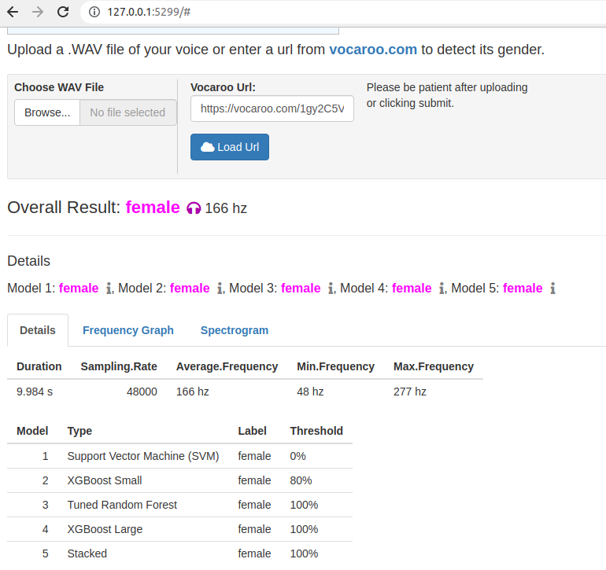
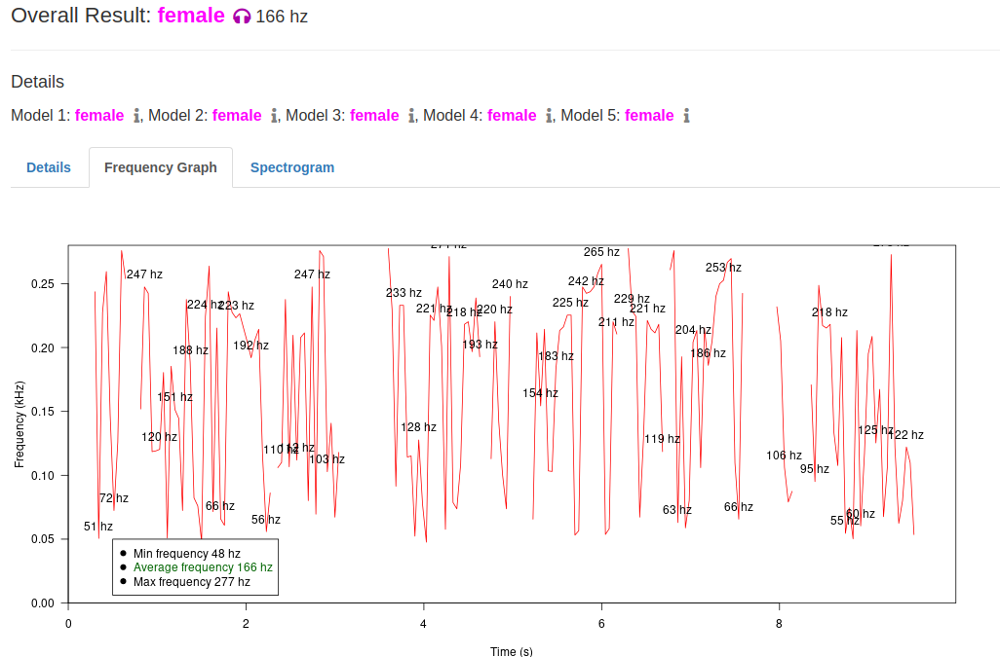
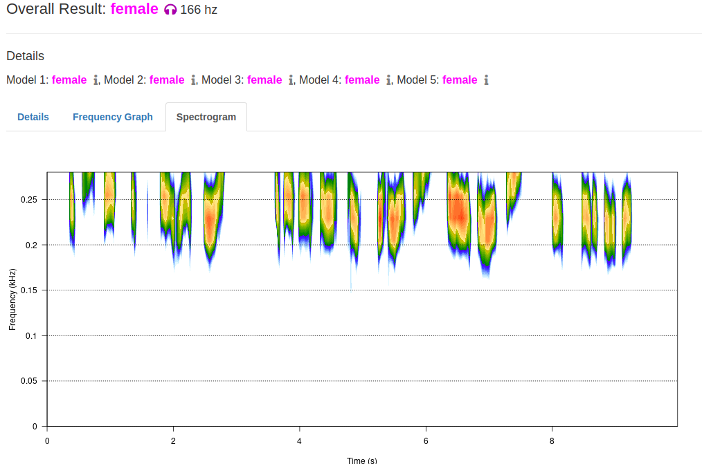

Voice Gender Web App
====================

This folder contains the code for running the web-based version of the voice-gender data-set.

The program allows users to upload an audio file or provide a url to an audio recording from [Vocaroo](http://vocaroo.com). The audio is analyzed in real-time and a result of male/female is displayed. The web application also provides a frequency graph and Spectrogram for visualizing frequency and pitch.

The web version is developed with R Shiny.

## Screenshots

### Results of an analysis



### Frequency graph



### Spectrogram



## Installation

1. Install the required Linux libraries with the following command.
```bash
sudo apt-get install libcurl4-openssl-dev cmake r-base-core fftw3 fftw3-dev pkg-config
```

2. If debugging using VSCode, install the [R Debugger](https://github.com/ManuelHentschel/VSCode-R-Debugger) from the Extensions panel.

3. In VSCode, click the Debug tool and run **Launch Shiny App**. A new browser should display with the web application running.
